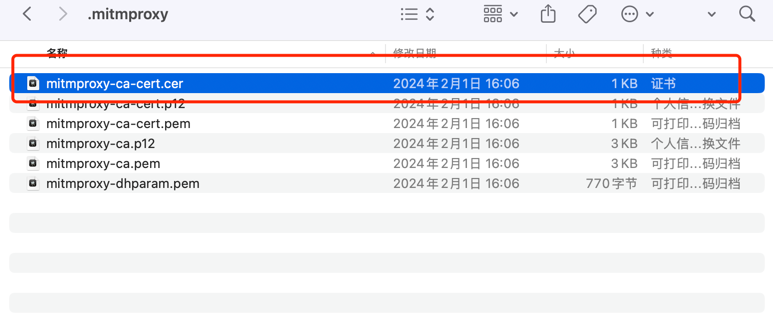
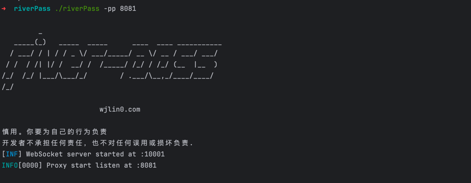
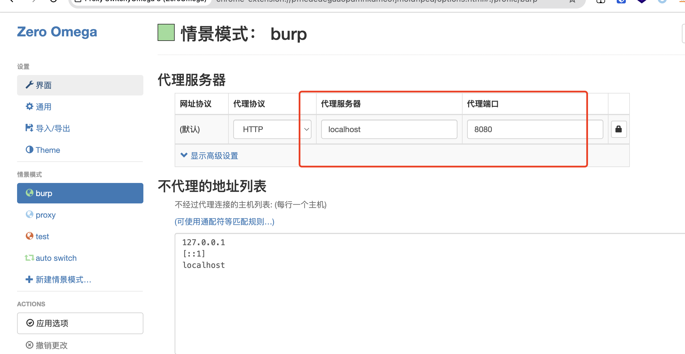
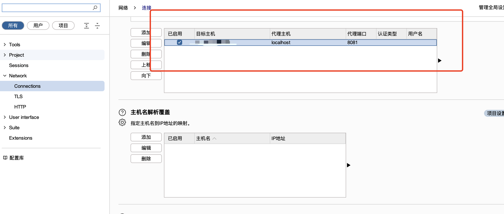
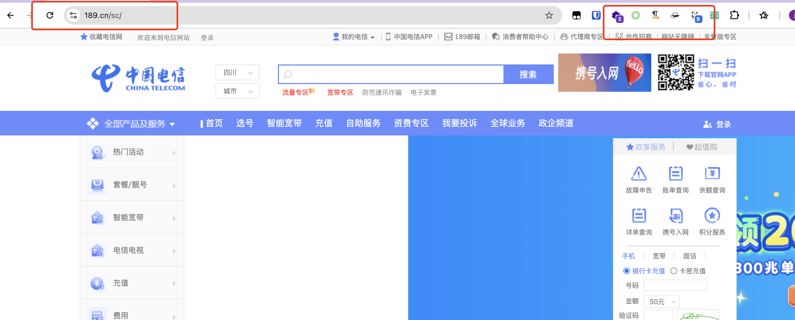
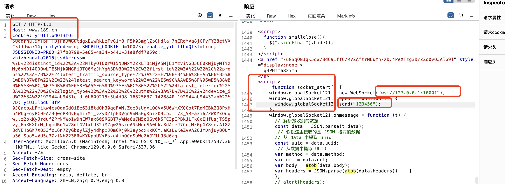
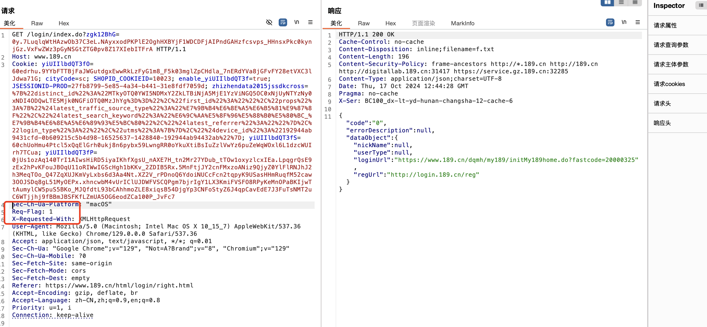
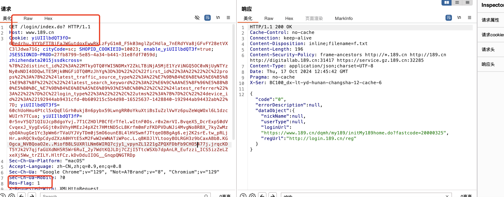

<h4 align="center">riverPass 是一个用Go编写的瑞数WAF绕过工具。它利用了WebSocket协议，将请求发送的自身浏览器中，从而绕过了瑞数WAF的检测。</h4>

<p align="center">

<a href="https://github.com/wjlin0/riverPass/releases/"></a> 
<a href="https://github.com/wjlin0/riverPass" ></a>
<a href="https://github.com/wjlin0/riverPass/releases"></a> 
<a href="https://github.com/wjlin0/riverPass"></a> 
<a href="https://blog.wjlin0.com/"></a>
</p>

# 特征

- 无需安装任意其他工具，只需导入`mitmproxy`证书即可使用
- 可自定义设置下游代理
- 支持联动Burp进行重放


# 安装riverPass
## 自行编译
riverPass自行编译，则需要**go1.23**才能安装成功。执行一下命令

```sh
go install -v github.com/wjlin0/riverPass/cmd/riverPass@latest
```
## 二进制
下载准备运行的[二进制文件](https://github.com/wjlin0/riverPass/releases/latest)

- [macOS-arm64](https://github.com/wjlin0/riverPass/releases/download/v1.0.0/riverPass_1.0.0_macOS_arm64.zip)

- [macOS-amd64](https://github.com/wjlin0/riverPass/releases/download/v1.0.0/riverPass_1.0.0_macOS_amd64.zip)

- [linux-amd64](https://github.com/wjlin0/riverPass/releases/download/v1.0.0/riverPass_1.0.0_linux_amd64.zip)

- [windows-amd64](https://github.com/wjlin0/riverPass/releases/download/v1.0.0/riverPass_1.0.0_windows_amd64.zip)

- [windows-386](https://github.com/wjlin0/riverPass/releases/download/v1.0.0/riverPass_1.0.0_windows_386.zip)


# 用法

```shell
riverPass -h
```
```yaml
riverPass 1.0.0 数瑞WAF绕过工具

Usage:
  ./riverPass [flags]

Flags:
输入:
  -pp, -proxy-port int          代理监听端口 (default 8001)
  -wp, -websocket-port int      websocket监听端口 (default 10001)
  -wt, -websocket-token string  websocket通信密钥 (default "123456")

代理:
  -p, -proxy string[]  下游代理

版本:
  -v, -version                 输出版本
  -update                      更新版本
  -duc, -disable-update-check  跳过自动检查更新


EXAMPLES:

运行 riverPass 并监听 8081端口:
  $ riverPass -pp 8081
运行 riverPass 设置下游代理:
  $ riverPass -proxy http://127.0.0.1:7890


```

**注意**：在此之前你必须导入`mitmproxy`的证书(若没有 可随意运行一次 `riverPass`,它位于你主机的 `$HOME/.mitmproxy` 目录下）



首先 运行 `riverPass`
```shell
$ riverPass -pp 8081
```


使用浏览器设置`Burp`代理



同时在`Burp` 设置目标



完成后，访问目标一次`https://www.189.cn/sc/`



其中你会在请求记录中，得到以下结果，则表明此时已经完成代理



对某一个包进行重复攻击,加入以下请求头

```text
Req-Flag: 1
```




其中，你可以在`Burp` 日志中，发现你刚刚重复的请求包



# 借鉴
- https://github.com/R0A1NG/Botgate_bypass
